✧˖°Uso del repositorio local en Git Bash ✧˖°

En este documento se realizará mención de los comandos que deben ser empleados para poder generar un repositorio local en tu directorio:

(Un repositorio local es un almacenador de archivos y modificaciones de código que se encuentra ubicado en el dispositivo en el que se está trabajando)

♡ `git config --global user`: Es el que permite al usuario dar a conocer la identidad con la que desea asociar los commits que va a realizar.
♡ `git config --global user`.name "nombre en comillas" : Se usa para configurar el nombre que se desea asociar.
♡ `git config --global user`.email "email en comillas" : Se usa para configurar el correo que se desea asociar.

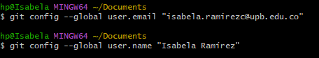

♡ `git config --list`: Es el que permite ver el contenido del archivo de configuración del sistema git en el que se está (en este se puede evidenciar la identidad con la que se registró el usuario).

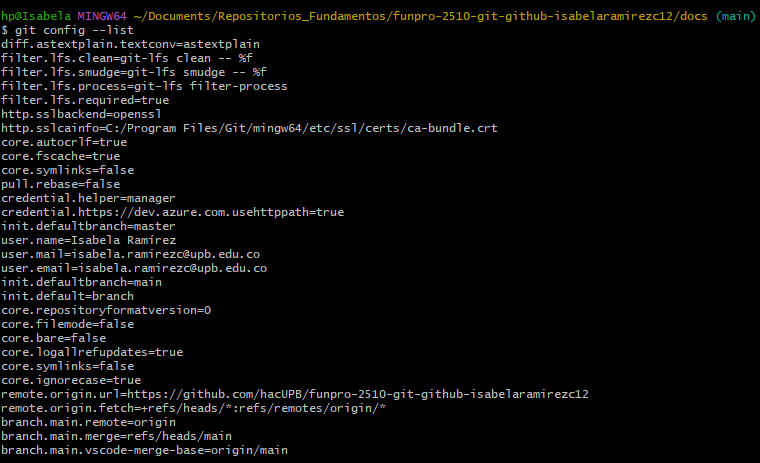

♡ `git init`: Es el que da inicio al repositorio.

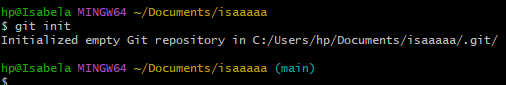

Como se evidencia en el ejemplo, al momento de usar el comando `git init` apareció la palabra "main" que es el indicativo de que se comenzó a registrar el directorio (comenzó repositorio).
(Si al momento de emplear ese comando aparece la palabra "master" debe usarse el comando ♡ `git config --global init.defaultbranch main` para lograr configurarlo como main y que se inicie el repositorio con éxito).

`rm -r .git`: Es el que permite eliminar el repositorio.

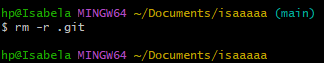

Como se evidencia en el ejemplo, al momento de usar el comando `rm -r .git` desapareció la palabra "main" que es el indicativo de que se eliminó el repositorio.

♡ `Git status`: Es el que permite conocer el estado actual del repositorio.

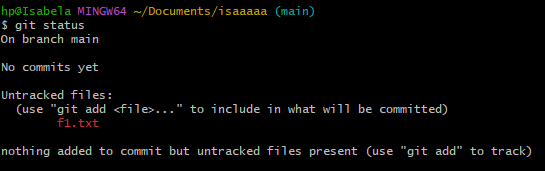

(Dependiendo de lo que aparezca al momento de usar `git status` se puede saber si hay archivos con modificaciones sin agregar al repositorio, si todo está bien o si hay algún cambio por hacer).

 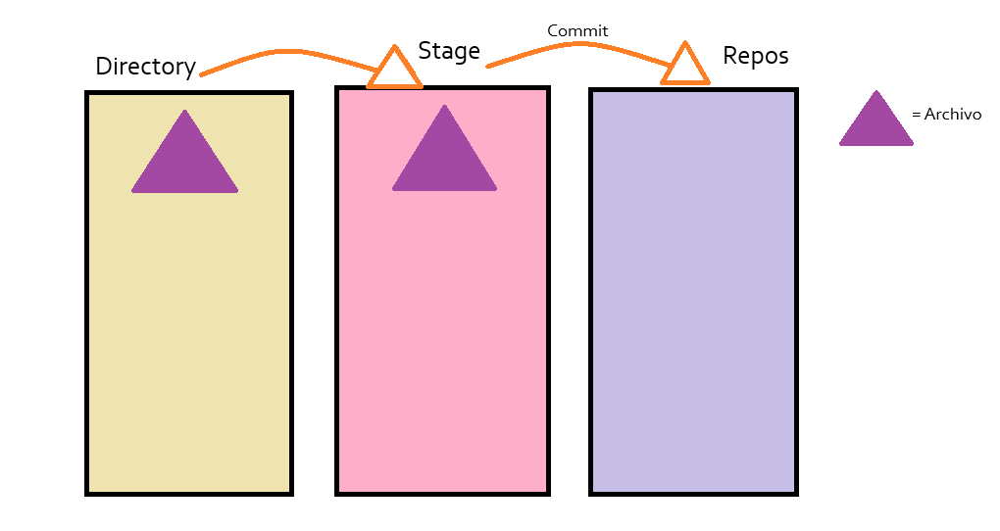

  (En la imagen se evidencia una breve explicación gráfica de los pasos para crear un commit y añadir así determinado elemento al repositorio).

♡ `Git add + nombre del archivo`: Es el primer paso para crear un commit, en este se pasa el archivo-carpeta del directory al stage, en este paso aún no se guarda historial del elemento completamente pero el stage lo guarda temporalmente y le crea historial.

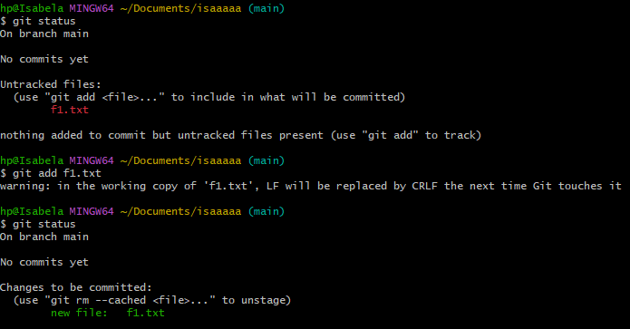

Como se evidencia en la imagen, al haber agregado el elemento con `git add`, este pasa de estar rojo a verde en `git status`, lo que significa que el archivo esta listo para ser añadido al repositorio con el siguiente comando.

♡ `Git rm --cached + nombre del archivo`: Es el comando que permite sacar el archivo-carpeta del stage al directory (Esto es muy útil al momento de querer realizar cambios en el documento antes de agregarlo permanentemente al repositorio). 

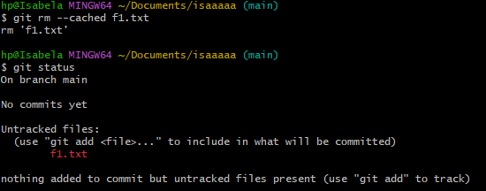

En la imagen se muestra como después de haber empleado el comando, el archivo en el `git status` vuelve a mostrarse rojo, lo que significa que el archivo puede ser modificado y debe volver a ser añadido al stage con `git add` para que esté listo para ser añadido al repositorio con el siguiente comando.

♡ `git commit -m "título commit"`: Es el comando final que se emplea para agregar permanentemente el elemento al repositorio.

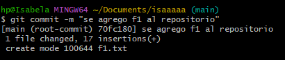

♡ `git commit --amend`: Es el que permite modificar el título que se le dió al commit.

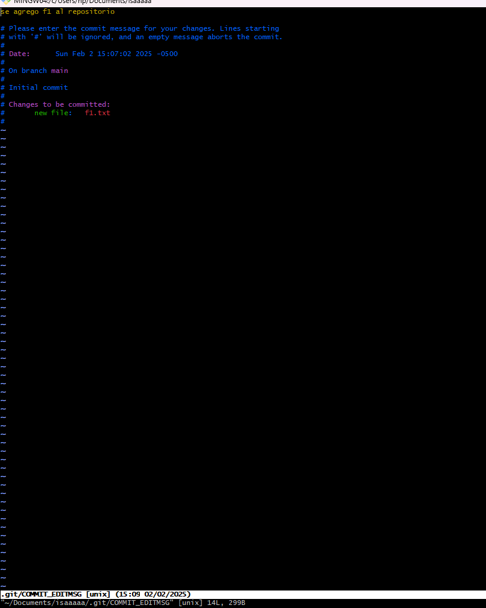

♡ `git log`: En este aparecen los commits realizados con información resumida sobre estos.

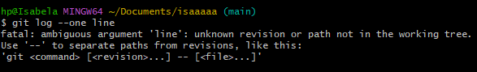

♡ `git checkout + código del commit que se quiere ver`: Conocer el estado de un commit en especial. 

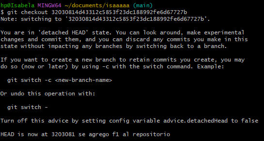

♡ `git switch - `: Este sirve para volver a la última versión del commit o para cambiar de rama.

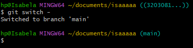

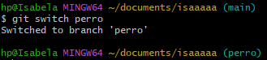

♡ `git restore`: Este es aquel que ayuda a eliminar cambios del archivo antes de pasarlo al stage.

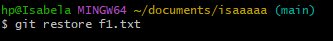

♡ `.gitignore`: Este es el comando que se emplea para decirle a git que archivos-carpetas se pueden ignorar, para así garantizar que si estos no se están rastreando en primer lugar, las cosas continuen así.

♡` git branch + nombre rama`: Crear una rama.

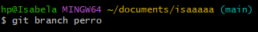

♡ `git branch -d + nombre rama`: Este comando sirve para eliminar una rama.

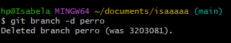

♡ `git add . `: Añadir todo lo que tengo al repositorio.

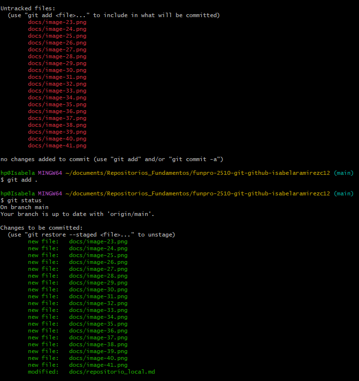

♡ `code .` : Entrar a visual studio code.

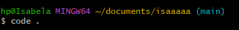

