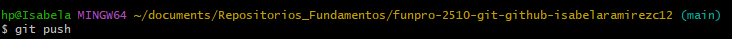
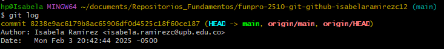

✧˖°Uso del repositorio remoto en Git Bash ✧˖°

En este documento se realizará mención de los comandos que deben ser empleados para poder generar un repositorio remoto en la web:

Cuando se tienen un repositorio local y se desea compartirlo con otros usuarios u obtenerlo a través de otro dispositivo, los repositorios remotos son la mejor solución.

Para crear un repositorio en la web deben utilizarse plataformas como "Git Hub" (para este caso en especial) y se debe crear una cuenta con la cuál se pueda acceder constantemente a esa página web y con el cuál se puedan sincronizar los repositorios.

Cuando ya se tengan todos los requerimientos completos para utilizar en este caso "Git Hub" se emplearán los siguientes comandos:

♡ `gh auth login`: Es el que permite al usuario autorizar a Git Hub acceder al computador.

♡`git clone`: Es el que permite clonar el repositorio remoto para así añadirlo al local

♡ `git remote set-url origin + URL`: Es el que permite al usuario modificar la URL si se puso de manera incorrecta al momento de colocarlo en el repositorio local, pero sin la necesidad de eliminarlo.

si se desea eliminarlo y mejor volverlo a resubir debe usarse el siguiente comando:

♡`git remote remove origin`

♡`git remote add origin`

Es importante recordar que al trabajar desde un repositorio remoto y luego agregarlo a un repositorio local y hacer modificaciones, esas modificaciones deben actualizarse en el repositorio remoto para que este siempre permanezca en la última versión, para esto se emplea el siguiente comando:

♡`git push`

Al realizarse ese comando automáticamente todos los cambiados realizados en el repositorio local serán agregados en el repositorio remoto y podrán ser evidenciados desde Git Hub.

Para saber si la versión de ambos repositorios esta sincronizada (ambas cuentan con la última versión) debe colocarse `git log` y debe aparecer el siguiente aviso:

`(HEAD -> master, upstream/master)`

Si por alguna razón el repositorio local y remoto tienen elementos diferentes se emplea el siguiente comando para fusionarlos:

♡`git pull`

