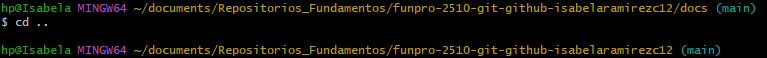
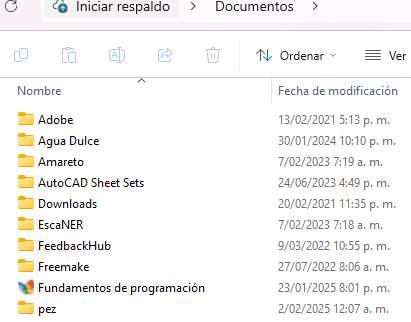
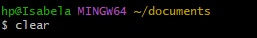

✧˖°Uso de la consola en Git Bash ✧˖°

En este documento se realizará mención de los comandos básicos que deben ser empleados para poder navegar y ejecutar lo que el usuario desee en su directorio:

♡ pwd: Es el que permite conocer en que directorio uno se encuentra en ese preciso momento.

Como se vió en el ejemplo, pwd permite evidenciar la ubicación de las carpetas-subcarpetas en las que uno se encuentra.

♡ ls: Es el que permite listar el contenido del directorio en el que uno se encuentra.

Como se vió en el ejemplo, ls permite conocer que carpetas o archivos se encuentran en el directorio actual.
Si se desea conocer archivos o carpetas ocultas debe emplearse: ♡ ls -la.

Como muestra la imagen, se está listando el mismo directorio, solo que gracias a ls -al se pueden evidenciar mas archivos-carpetas que antes permanecían ocultas.

♡ cd + nombre del directorio: Es el que permite tener acceso al directorio que se desee.

A través del ejemplo se puede evidenciar como después de haber ejecutado el comando se logró ingresar al directorio "docs".
cd también puede tener más usos si se le adicionan caracteres específicos, ♡ cd .. permite salir del repositorio actual y ♡ cd ~  volver al directorio asociado al user (directorio inicial).

Ejemplo cd ..

Ejemplo cd ~ 

♡ mkdir: Es el que permite crear un directorio.

♡ touch: Es el que permite crear un archivo (touch + "nombre del archivo"."atajo del archivo[txt, png, md etc]).

♡ mv: Es el que permite mover o renombrar un archivo.
Para mover de lugar: mv nombre_origen nombre_destino.

Para cambiar de nombre: mv nombre_actual nombre_nuevo.

♡ find: Es el que permite encontrar un archivo (find. name "nombre archivo").

Si se desea buscar un documento con  cierta extensión debe colocarse el comando así: find. name "nombre archivo.extensión"

♡ rm: Es el que permite borrar un archivo.
rm "nombre del archivo" (borrar un documento)

rm -r "nombre del directorio" (borrar un directorio y toda la información que este contenga)

♡ vim: Es el que permite editar un documento.

Al iniciar vim para editar un documento deben tenerse en cuenta los siguientes comandos:
i: insertar.
Esc: Salir de la edición.
x: salir y guardar.
q: salir sin guardar.
: = comandos.

♡ cat: Es el que permite visualizar las ediciones realizadas en el documento.

♡ clear: Es el que permite limpiar el directorio local en el momento que se desee.

